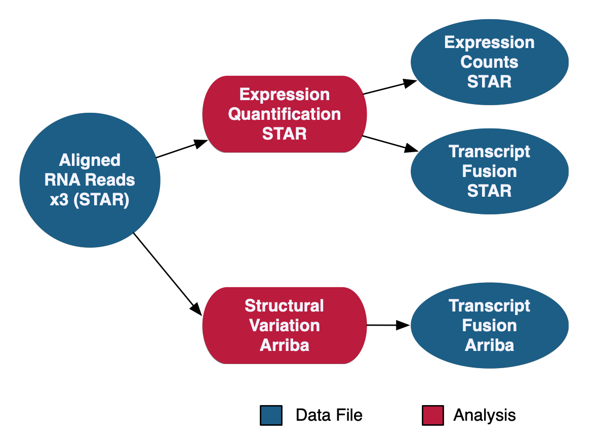

## Project I. Gene Expression Analysis

The RNA-Seq Analysis pipeline quantifies protein-coding gene expression based on the number of reads aligned to each gene. A "two-pass" method is used in which RNA-Seq reads are first aligned to the reference genome to detect splice junctions. A second alignment is then performed using the information from splice junctions to increase the quality of the alignment. Read counts are measured on a gene level using STAR and normalized using the Fragments Per Kilobase of transcript per Million mapped reads (FPKM) and FPKM Upper Quartile (FPKM-UQ) methods with custom scripts. Transcript fusion files are also generated using STAR Fusion and Arriba. HTSeq quantification is no longer supported as of Data Release 32 with the new GENCODE v36 data model.

[Genomic Data Commons](https://gdc.cancer.gov/about-data/gdc-data-processing/genomic-data-processing#Overview)

