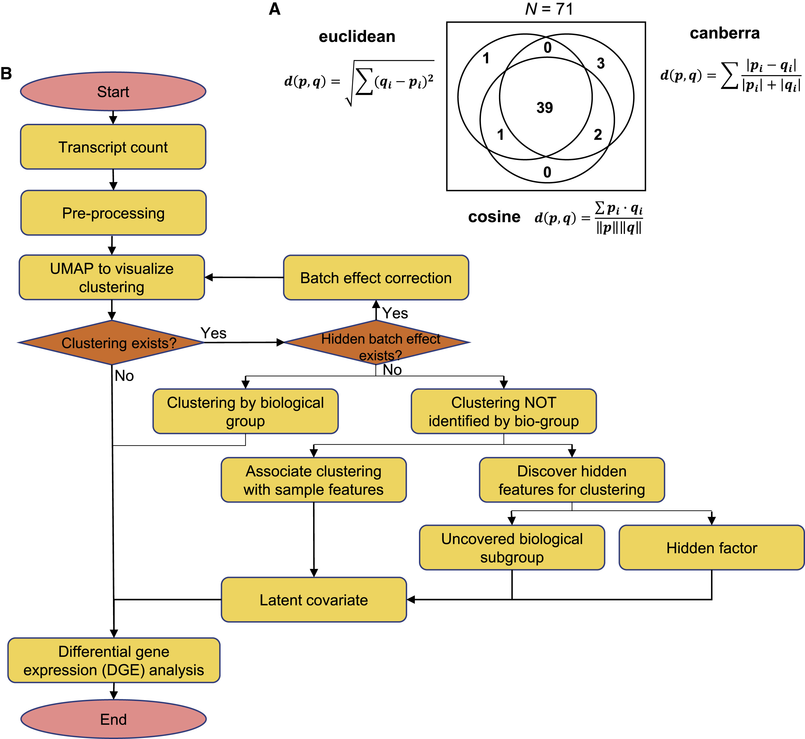

## Background:

In a previous study, heterogeneity exploration of bulk transcriptomic profiling was visually and quantitatively compared by applying PCA, MDS, t-SNE, and UMAP when parameters were set as default. In 71 sizable datasets of bulk transcriptomic profiling in two-dimensional space, UMAP was shown to be superior in preserving sample-level neighborhood information and maintaining clustering accuracy, thus conspicuously differentiating batch effects, identifying pre-defined biological groups, and identifying clustering structures associated with biological features and clinical meaning.

However, clustering suffers from both the limitations of the algorithms and the Curse of Dimensionality, which often results in a less consensus between the visual interpretation of the tSNE plot and the clusters generated. In the absence of hyper-parameter optimization performed on the clustering models or for the embedding spaces generated by dimensionality reduction techniques (t-SNE, UMap, etc), the results can be unreliable due to reproducibility issues. 

Paper: [Dimensionality reduction Application by UMAP in bulk transcriptomic data](https://www.sciencedirect.com/science/article/pii/S2211124721008597)

## Problem statement
Given the unpredictable nature of clustering algorithms and often non-intuitive nature of a-priori expectation of an embedding manifold, we want to investigate the effect on hyper-parameter optimization on cluster models and embedding space of UMap for better stratification of cohorts in bulk-transcriptomics datasets. 

#### Goals:

For ~1500 samples total for 3 sub-types of Kidney cancer and 60660 gene expression features (Normalized fragments per kilo million[fpkm]), how well can we stratify the sub-types and quantify genes associated with each cohort? 

###### A. Sub-type stratification:

A.1. Visual results:
- How well do default embeddings of UMAP in euclidean and non-euclidean spaces separate the 3 cohorts? 
- How does hyper-parameter optimized model of UMAP + clustering compare in cohort stratification compared to default embeddings?
- Which method provides best overall stratification of the sub-types visually?
- Which method shows better segregation of batch effects?

A.2. Performance results: 
- What is the performance of different clustering methods on DR projections?
  - Metrics for measuring performance of clustering methods based on the paper:

    1) Clustering accuracy
    2) Neighborhood preserving
    3) Computational efficiency 
   
-  How does best UMAP model compare to other DR methods (t-SNE, Local linear embedding, etc) in terms of supervised learning performance? 
   -  Metrics:
      
      - Accuracy
      - Precision
      - Recall 

- How good is the biological interpretability of clusters formed compared to other methods (t-SNE, PCA, spectral clustering, etc)?  


###### B. Quantification of genes associated with sub-types:

- What genes are up-regulated or down-regulated in one sub-chort vs another? i.e what are the differential gene expressions between 2 cohorts?


## Recommended UMAP Pipeline

[Paper reference](https://www.sciencedirect.com/science/article/pii/S2211124721008597#sec4) Yang Yang, Hongjian Sun, Yu Zhang, Tiefu Zhang, Jialei Gong, Yunbo Wei, Yong-Gang Duan, Minglei Shu, Yuchen Yang, Di Wu, Di Yu,
Dimensionality reduction by UMAP reinforces sample heterogeneity analysis in bulk transcriptomic data,
Cell Reports,
Volume 36, Issue 4,
2021,
109442,
ISSN 2211-1247,
https://doi.org/10.1016/j.celrep.2021.109442.

    
## Methods/Software Utilities

#### Software utilities
###### I. Pre-Processing utililies for DR:
 - Transformations:
   - Using standard scaler on fpkm_unstranded values for tightening the range of values.
   - Using log transformation 
   - Variance stabilized transformation  
 - Using 3 different types of mappers (plane, sphere and hyperbeloid), visualize the reduced dataset for Class Labels TCGA-KICH, TCGA-KIRC, TCGA-KIRP

###### II. List of DR to be explored

- Parametric (neural network) Embedding
- t-SNE
- PCA
- MDS
- UMap 

###### III. List of clustering methods to be applied:

- K-means
- Hierarchical 
- Spectral 
- HDBScan
- GMM
- Possibly deep learning methods? [Review Paper link](https://academic.oup.com/bib/article/22/1/393/5721075) 


A list of 10 of the more popular algorithms is as follows:
([Examples of clustering methods applied](https://machinelearningmastery.com/clustering-algorithms-with-python/))
- Affinity Propagation
- Agglomerative Clustering
- BIRCH
- DBSCAN
- K-Means
- Mini-Batch K-Means
- Mean Shift
- OPTICS
- Spectral Clustering
- Mixture of Gaussians

#### Method details:
###### I. Investigation of group separation by different UMAP models.
Objective: Given the raw RNA-Seq gene expression data of kidney cancer in 3 sub-types, can a simple projection of the high-dimensional features into euclidean or non-euclidean space give good cohort stratification? 

Models used to generate embeddings:
1) Umap with default config - This generates embeddings in the euclidean space

2) Umap with  ```Hyperbeloid``` output metric - Generates a non-euclidean space embedding. 
    
###### II. Investigation of more optimized and well separated clustering structures in kidney cancer

###### Objective: 
Given that initial Umap embeddings did not capture separation of clusters to provide any strong insight into underlying biological or batch effects, we want to apply a bayesian hyper parameter optimization strategy for UMAP embeddings + DBSCAN clustering to get  optimal parameters for UMAP and DBSCAN.

###### Motivation for using HDbScan over other clustering models:
HDBSCAN, i.e. Hierarchical DBSCAN, is a powerful density-based clustering algorithm which is: 
1) indifferent to the shape of clusters, 
2) does not require the number of clusters to be specified, 
3) robust with respect to clusters with different density. 
4) Further, HBDSCAN is very attractive because it has only one hyperparameter minimum cluster size which is the minimal number of points in a cluster. 
5) It is relatively fast for large data sets, detects outlying cells, and for each cell it reports a probability of assignment to a cluster

###### Evaluation of best clusters to select the best hyperparameters:

- Silhouette Score is not a good validation metric for density-based algorithms like DBSCAN and HDBSCAN since it assumes all points are assigned a group and can’t appropriately handle noise/outliers that are seen in the initial clustering of our UMAP embeddings at the intersection of different project (Fig 1A, 1B and 1C). 

- Density Based Cluster Validation (DBCV) has been proposed and used by some for tuning HDBSCAN hyperparameters. While it likely works well for several applications, it can favor having a smaller number of clusters and leaving too many samples in the “noise” category

- Here we will leverage ```HDbScan's``` probabilities attribute. 
  - Definition from documentation: The strength with which each sample is a member of its assigned cluster. Noise points have probability zero; points in clusters have values assigned proportional to the degree that they persist as part of the cluster

Cost function = percent of dataset with < 10% cluster label confidence


## Visualizations/Results:

This section has the visualization of sub-cohorts after DR, interpretation of results and visualization of quantifying metrics for measuring clustering accuracy, neighborhood preservation and classification accuracy. 

#### I. Investigation of group separation by different UMAP embeddings:

Performance of UMAP as a function of different embedding spaces: 

###### Umap using default configurations:
      
Fig 1.A. Plane embedding shows separation of clustering structures by project_id
   
Fig 1.B. Hyperbeloid embedding supports the clustering by project_id  

    
<!-- Fig 1.C. Example of 3D visualization shows separate projects by clustering structures    -->


###### Interpretation:

In the 2-D plots, there are 4 distinct clusters that are observed. 3 of the 4 clusters have majority of the class labels being well separated. However, there is one cluster that seems mixed with all three sub-types of kidney cancer. 
 
- The well separater Orange, Green and Blue clusters of TCGA-KIRP, TCGA-KICH and TCGA-KIRC cohorts seem to be from 3 different projects.  
- However the overall separation boundary between projects is not as distinct.
- Additionally, The mixed 4th group might correspond to a different biological group. 


##### II. Investigation of more optimized and well separated clustering structures in kidney cancer

Fig 2.A. Separation of clustering structures with bayesian optimized HDbScan


###### Interpretation:

1. In the 3 plots in figure 2.A, bayesian optimized Umap Cosine embedding with HDbScan clustering leads to identification of 6 well separated clusters. 
   1. 4 large clusters (0, 2,3 and 5) are seen. 
   2. 2 small clusters (1 and 4) are seen. 

2. The 4 large clusters are similar to the 4 large clusters seen in figure 1.A and 1.B, but with better separation. 
   1. The large clusters (0, 2, 3) are representative of the 3 kidney cancer subtypes (KIRC, KIRP and KICH)
   2. The large cluster (5) comprised of mixed populations of the 3 kidney cnacer subtypes are representative of a "SOLID TISSUE NORMAL" Tumor as compared to "PRIMARY TUMOR" in clusters (0,2,3)

3. Overall, the bayesian optimized Umap HdbScan is able to improve separability of clustering structures based on biological background. 


#### NEXT STEPS:

Evaluation of Classification Performance results: 
- What is the performance of different clustering methods on DR projections?
  - Metrics for measuring performance of clustering methods based on the paper:

    1) Clustering accuracy
    2) Neighborhood preserving
    3) Computational efficiency 
   
-  How does best UMAP model compare to other DR methods (t-SNE, Local linear embedding, etc) in terms of supervised learning performance? 
   -  Metrics:
      
      - Accuracy
      - Precision
      - Recall 

- How good is the biological interpretability of clusters formed compared to other methods (t-SNE, PCA, spectral clustering, etc)?  