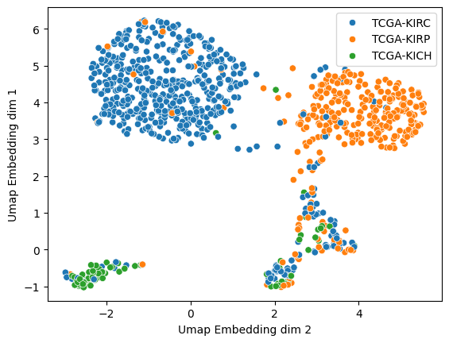
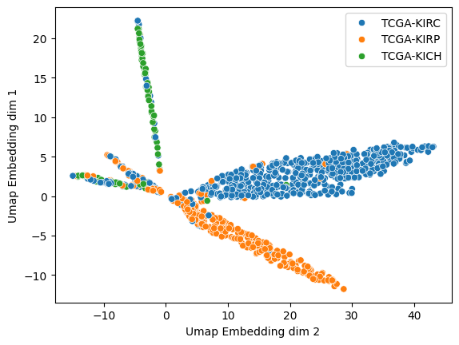
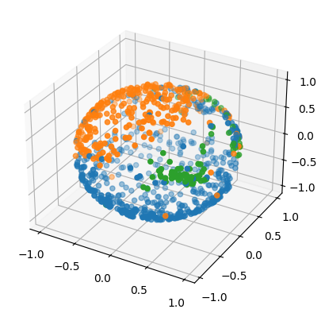

## Background:

In a previous study, we  heterogeneity exploration of bulk transcriptomic profiling was visually and quantitatively compared by applying PCA, MDS, t-SNE, and UMAP when parameters were set as default. In 71 sizable datasets of bulk transcriptomic profiling in two-dimensional space, UMAP was shown to be superior in preserving sample-level neighborhood information and maintaining clustering accuracy, thus conspicuously differentiating batch effects, identifying pre-defined biological groups, and identifying clustering structures associated with biological features and clinical meaning.

Paper: [Dimensionality reduction Application by UMAP in bulk transcriptomic data](https://www.sciencedirect.com/science/article/pii/S2211124721008597)

## Problem statement

Given ~1500 samples total for 3 sub-types of Kidney cancer and 60660 gene expression features (Normalized fragments per kilo million[fpkm]), how well can we stratify the sub-types and quantify genes associated with each cohort? 

### Questions:

##### Sub-type stratification:
- Which method provides best overall stratification of the sub-types visually?

- Which method shows better segregation of batch effects?
  
- What is the performance of different clustering methods on DR projections?
  - Metrics for measuring performance of clustering methods based on the paper:

    1) Clustering accuracy
    2) Neighborhood preserving
    3) Computational efficiency 
   
-  How does best UMAP model compare to other DR methods (t-SNE, Local linear embedding, etc) in terms of supervised learning performance? 
   -  Metrics:
      
      - Accuracy
      - Precision
      - Recall 

- How good is the biological interpretability of clusters formed compared to other methods (t-SNE, PCA, spectral clustering, etc)?  

##### Quantification of genes associated with sub-types:

- What genes are up-regulated or down-regulated in one sub-chort vs another? i.e what are the differential gene expressions between 2 cohorts?
 
   
## Methods
#### I. Pre-Processing for DR:
 - Transformations:
   - Using standard scaler on fpkm_unstranded values for tightening the range of values.
   - Using log transformation 
   - Variance stabilized transformation  
 - Using 3 different types of mappers (plane, sphere and hyperbeloid), visualize the reduced dataset for Class Labels TCGA-KICH, TCGA-KIRC, TCGA-KIRP

#### II. List of DR to be explored

- Parametric (neural network) Embedding
- t-SNE
- PCA
- MDS
- UMap 

#### III. List of clustering methods to be applied:

- K-means
- Hierarchical 
- Spectral 
- HDBScan
- GMM
- Possibly deep learning methods? [Review Paper link](https://academic.oup.com/bib/article/22/1/393/5721075) 

## Visualizations/Results:

This section has the visualization of sub-cohorts after DR, interpretation of results and visualization of quantifying metrics for measuring clustering accuracy, neighborhood preservation and classification accuracy. 

#### I. Visualizations of UMAP (Potential Identification of Batch effects):

Performance of UMAP as a function of different embedding spaces: 

1. 2D plots for plane and hyperbeloid embedding mappers 
   

   
 

2. 3D plot for sphere mapper 
   
   

3. Interpretation:

In the 2-D plots, there are 4 distinct clusters that are observed. 3 of the 4 clusters have majority of the class labels being well separated. However, there is one cluster that seems mixed with all three sub-types of kidney cancer. This might be due to 
   - Batch effects in the samples due to confounding factors (collection date, etc)
   - Even after normalization with sklearn's standard scaler,  log transformation might be needed. 