```python
import src.DimRedMappers.clusterer
import  src.DimRedMappers.umap_embedders
from importlib import reload
reload(src.DimRedMappers.clusterer)
reload(src.DimRedMappers.umap_embedders)

import pandas as pd 
import numpy as np
from sklearn.preprocessing import FunctionTransformer
from sklearn.model_selection import train_test_split
import matplotlib.pyplot as plt
import seaborn as sns
```

    /opt/homebrew/anaconda3/envs/umap-env/lib/python3.11/site-packages/tqdm/auto.py:21: TqdmWarning: IProgress not found. Please update jupyter and ipywidgets. See https://ipywidgets.readthedocs.io/en/stable/user_install.html
      from .autonotebook import tqdm as notebook_tqdm


```python
import fasttreeshap
```

## I. Data Preprocessing and transformation

## 1.1 Read and wrangle the data to get gene expression features and clinical data into a single dataframe


```python
## Read labels and gene expression data 
fpkm_unstr_df_with_labels = pd.read_csv('./Transcriptomics/data/processed_data/fpkm_unstr_data_with_labels.csv')
gene_cols = fpkm_unstr_df_with_labels.columns.to_numpy()[:60660]
exposure_tsv = pd.read_csv('./Transcriptomics/data/clinical.cart.2023-10-29/exposure.tsv', sep='\t')


## some columns have whitespace that needs to be removed for better processing
new_columns = fpkm_unstr_df_with_labels.columns.str.replace(' ', '_').to_numpy()
fpkm_unstr_df_with_labels.columns = new_columns 

## Merge exposure data to get labels for tumor type and kidney subtype
ge_kidney_cancer_data_with_tgca_labels = pd.merge(fpkm_unstr_df_with_labels,
                                                  exposure_tsv[['case_submitter_id', 'project_id']],
                                                  left_on='Case_ID',
                                                  right_on='case_submitter_id')
```

## 1.2. Data transformation

Here, given we have RNA-Seq Gene expression data we apply some commonly applied data transformations

1. **Log transformation**: Gene expression values have a very wide range from (0, 500000) usually in the form of a spike-slab distribution. Hence need to tighten the range with a log transform
2. **Subsetting**: For purposes of this analysis we only want to look at 3 sub-types of kidney cancer samples ('TCGA-KIRC', 'TCGA-KICH', 'TCGA-KIRP')
3. **Label conversion**: Converting categorical labels into numerical labels for compatibility with machine learning algorithms


```python
description_df = fpkm_unstr_df_with_labels.iloc[:, :60660].describe().reset_index()
showing_value_range = description_df[description_df['index'].isin(['min', 'mean', 'max'])].iloc[:,1:].values.flatten()

```


```python
ax = sns.distplot(showing_value_range)
ax.set_title("Distribution of min, mean, max of all gene expression values" )
```

    
    
    `distplot` is a deprecated function and will be removed in seaborn v0.14.0.
    
    Please adapt your code to use either `displot` (a figure-level function with
    similar flexibility) or `histplot` (an axes-level function for histograms).
    
    For a guide to updating your code to use the new functions, please see
    https://gist.github.com/mwaskom/de44147ed2974457ad6372750bbe5751
    
    is_categorical_dtype is deprecated and will be removed in a future version. Use isinstance(dtype, CategoricalDtype) instead
    use_inf_as_na option is deprecated and will be removed in a future version. Convert inf values to NaN before operating instead.


    Text(0.5, 1.0, 'Distribution of min, mean, max of all gene expression values')


    

    


```python

## Subset only 3 types of cancer sub-type from the dataset 
ge_kidney_cancer_data_correct_labels = (ge_kidney_cancer_data_with_tgca_labels[ge_kidney_cancer_data_with_tgca_labels['project_id'].isin(
    ['TCGA-KIRC', 'TCGA-KICH', 'TCGA-KIRP']
)]
)

## Apply log transformation
transformer = FunctionTransformer(np.log10)
ge_kidney_cancer_data_correct_labels[gene_cols] = ge_kidney_cancer_data_correct_labels[gene_cols] + 1
ge_kidney_cancer_data_correct_labels[gene_cols] = transformer.fit_transform(ge_kidney_cancer_data_correct_labels[gene_cols])

## Convert categorical labels to numerical labels 
columns_for_one_hot = ['project_id', 'Sample_Type']
ml_df = pd.get_dummies(ge_kidney_cancer_data_correct_labels, columns=['project_id', 'Sample_Type'], prefix=['cancer_subtype', 'tumor_subtype'])
```

    
    A value is trying to be set on a copy of a slice from a DataFrame.
    Try using .loc[row_indexer,col_indexer] = value instead
    
    See the caveats in the documentation: https://pandas.pydata.org/pandas-docs/stable/user_guide/indexing.html#returning-a-view-versus-a-copy
    
    A value is trying to be set on a copy of a slice from a DataFrame.
    Try using .loc[row_indexer,col_indexer] = value instead
    
    See the caveats in the documentation: https://pandas.pydata.org/pandas-docs/stable/user_guide/indexing.html#returning-a-view-versus-a-copy


```python
columns_for_one_hot = ['project_id', 'Sample_Type']
ge_kidney_cancer_data_correct_labels['project_id_orig'] =ge_kidney_cancer_data_correct_labels['project_id']
ge_kidney_cancer_data_correct_labels['Sample_Type_orig'] = ge_kidney_cancer_data_correct_labels['Sample_Type']
ml_df = pd.get_dummies(ge_kidney_cancer_data_correct_labels, columns=['project_id', 'Sample_Type'], prefix=['cancer_subtype', 'tumor_subtype'])

```

    DataFrame is highly fragmented.  This is usually the result of calling `frame.insert` many times, which has poor performance.  Consider joining all columns at once using pd.concat(axis=1) instead. To get a de-fragmented frame, use `newframe = frame.copy()`
    
    A value is trying to be set on a copy of a slice from a DataFrame.
    Try using .loc[row_indexer,col_indexer] = value instead
    
    See the caveats in the documentation: https://pandas.pydata.org/pandas-docs/stable/user_guide/indexing.html#returning-a-view-versus-a-copy
    DataFrame is highly fragmented.  This is usually the result of calling `frame.insert` many times, which has poor performance.  Consider joining all columns at once using pd.concat(axis=1) instead. To get a de-fragmented frame, use `newframe = frame.copy()`
    
    A value is trying to be set on a copy of a slice from a DataFrame.
    Try using .loc[row_indexer,col_indexer] = value instead
    
    See the caveats in the documentation: https://pandas.pydata.org/pandas-docs/stable/user_guide/indexing.html#returning-a-view-versus-a-copy


## II. Exploratory Analysis

## 2.1 Check overall info of datatypes, null values


```python
ge_kidney_cancer_data_correct_labels.info()
```

    <class 'pandas.core.frame.DataFrame'>
    Index: 924 entries, 2 to 1293
    Columns: 60673 entries, ENSG00000000003.15 to Sample_Type_orig
    dtypes: float64(60660), object(13)
    memory usage: 427.7+ MB


## 2.2. Check Unique sample IDs


```python
print(f"The total patient ids are {ge_kidney_cancer_data_correct_labels['Case_ID'].count()}, from those the unique ids are {ge_kidney_cancer_data_correct_labels['Case_ID'].value_counts().shape[0]} ")
```

    The total patient ids are 924, from those the unique ids are 799 


## 2.3. Check number of data labels by project type and tumor type


```python
ge_kidney_cancer_data_correct_labels.groupby(['Sample_Type'])['Sample_Type'].count()
```


    Sample_Type
    Additional - New Primary      2
    Primary Tumor               800
    Solid Tissue Normal         122
    Name: Sample_Type, dtype: int64


```python
ax = sns.countplot(x='Sample_Type', data=ge_kidney_cancer_data_correct_labels)
ax.bar_label(ax.containers[0])

```

    is_categorical_dtype is deprecated and will be removed in a future version. Use isinstance(dtype, CategoricalDtype) instead
    is_categorical_dtype is deprecated and will be removed in a future version. Use isinstance(dtype, CategoricalDtype) instead
    is_categorical_dtype is deprecated and will be removed in a future version. Use isinstance(dtype, CategoricalDtype) instead


    [Text(0, 0, '800'), Text(0, 0, '122'), Text(0, 0, '2')]


    
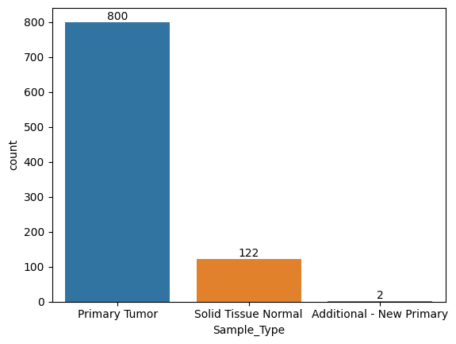
    


```python
ge_kidney_cancer_data_correct_labels.groupby(['project_id'])['project_id'].count()
```


    project_id
    TCGA-KICH     84
    TCGA-KIRC    539
    TCGA-KIRP    301
    Name: project_id, dtype: int64


```python
ax = sns.countplot(x='project_id', data=ge_kidney_cancer_data_correct_labels)
ax.bar_label(ax.containers[0])

```

    is_categorical_dtype is deprecated and will be removed in a future version. Use isinstance(dtype, CategoricalDtype) instead
    is_categorical_dtype is deprecated and will be removed in a future version. Use isinstance(dtype, CategoricalDtype) instead
    is_categorical_dtype is deprecated and will be removed in a future version. Use isinstance(dtype, CategoricalDtype) instead


    [Text(0, 0, '539'), Text(0, 0, '301'), Text(0, 0, '84')]


    
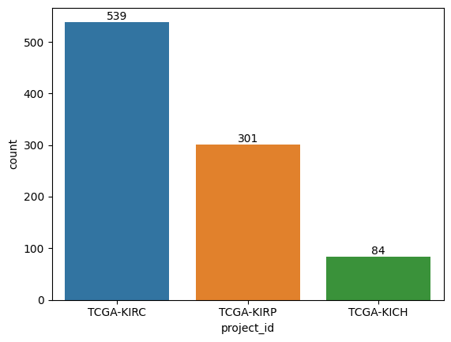
    


## III. Data sampling, Augmentation and splitting into training, testing and validation sets for Supervised Clustering 

Given that we have imbalanced datasets for Tumor Types and Kidney Cancer subtypes (project_id), we should consider the following for an **unbiased analysis** 

1. **Patient overlap**: Given 924 total patients with 799 unique, 
   
   <br>

   1. We should keep same ID patients in only one set i.e (Training or Validation or Testing)
   2. Preferably, we should have have all overlapping patients in Testing so as to not bias our training 

<br>

2. **Set Sampling**: For minority classes, we sample atleast X% into our testing first followed by validation and then all the remaining in training.

3. Additionally for one of the minority classes (New Primary - we should group it into the same category as Primary)

4. **Data augmention**: Applying oversampling, undersampling techniques for minority or majority classes 

## 3.1. Label correction of Additional - New Primary tumor


```python
ge_kidney_cancer_data_correct_labels['Sample_Type'] = ge_kidney_cancer_data_correct_labels['Sample_Type'].apply(lambda x: 'Primary Tumor' if x == 'Additional - New Primary' else x)
```

    
    A value is trying to be set on a copy of a slice from a DataFrame.
    Try using .loc[row_indexer,col_indexer] = value instead
    
    See the caveats in the documentation: https://pandas.pydata.org/pandas-docs/stable/user_guide/indexing.html#returning-a-view-versus-a-copy


```python
ge_kidney_cancer_data_correct_labels.groupby(['Sample_Type'])['Sample_Type'].count()
```


    Sample_Type
    Primary Tumor          802
    Solid Tissue Normal    122
    Name: Sample_Type, dtype: int64


```python
ax = sns.countplot(x='Sample_Type', data=ge_kidney_cancer_data_correct_labels)
ax.bar_label(ax.containers[0])

```

    is_categorical_dtype is deprecated and will be removed in a future version. Use isinstance(dtype, CategoricalDtype) instead
    is_categorical_dtype is deprecated and will be removed in a future version. Use isinstance(dtype, CategoricalDtype) instead
    is_categorical_dtype is deprecated and will be removed in a future version. Use isinstance(dtype, CategoricalDtype) instead


    [Text(0, 0, '802'), Text(0, 0, '122')]


    
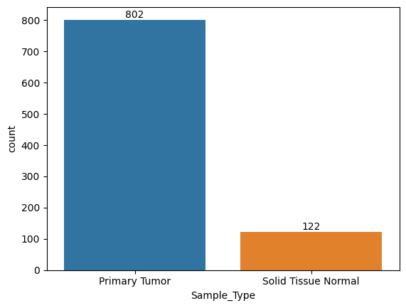
    


## 3.2 Separation of training, validation and testing data for unbiased analysis

Strategy
1. Find pairs of all duplicate sample IDs and randomly sample pairs 70% in training, 20% in validation and 10% in testing (with seed)
2. Out of the remaining samples For the 2 lowest groups KICH (10% - 84 samples) and Solid tissue(13% - 122 samples) put more than 25% samples into testing set first 
   1. Take union of 21 samples from KICH (25%) and 30 samples from Solid tissue (25%)  and put all those samples into testing set first
   2. Hold out this set till model training has occurred 
   3. Out of the remaining samples, again put more than 25% samples from minority classes into validation
   4. Put all the remaining into training 


```python
from sklearn.model_selection import train_test_split
```


```python
y_true = ml_df.iloc[:, -6:].drop(['tumor_subtype_Additional - New Primary'], axis=1).astype(int).to_numpy()
```


```python
# Count of each unique value
value_counts = ml_df['Case_ID'].value_counts()

# list of duplicate ids
duplicate_ids = value_counts[value_counts > 1].reset_index()['Case_ID'].unique()
```

## 3.2.1 Separating patient overlap samples


```python
# First split: Separate out a test set
train_val_ids, test_overlap_ids = train_test_split(duplicate_ids, test_size=0.1, random_state=42)

# Second split: Separate the remaining data into training and validation sets
train_overlap_ids, val_overlap_ids = train_test_split(train_val_ids, test_size=0.2, random_state=42) # 0.25 x 0.8 = 0.2

print(f"Number of Patient overlap Training IDs: {len(train_overlap_ids)}")
print(f"Number of Patient overlap Validation IDs: {len(val_overlap_ids)}")
print(f"Number of Patient overlap Testing IDs: {len(test_overlap_ids)}")
```

    Number of Patient overlap Training IDs: 87
    Number of Patient overlap Validation IDs: 22
    Number of Patient overlap Testing IDs: 13


## 3.2.2 Set sampling

Shows that majority of duplicate samples came from the Solid tissue class


```python
ml_df_without_overlap = ml_df[~ml_df['Case_ID'].isin(duplicate_ids)].reset_index(drop=True)
```


```python
ax1 = sns.countplot(x='Sample_Type', data=ge_kidney_cancer_data_correct_labels)
ax1.bar_label(ax1.containers[0])
ax1.set_title("Count of samples originally across tumors")
```

    is_categorical_dtype is deprecated and will be removed in a future version. Use isinstance(dtype, CategoricalDtype) instead
    is_categorical_dtype is deprecated and will be removed in a future version. Use isinstance(dtype, CategoricalDtype) instead
    is_categorical_dtype is deprecated and will be removed in a future version. Use isinstance(dtype, CategoricalDtype) instead


    Text(0.5, 1.0, 'Count of samples originally across tumors')


    
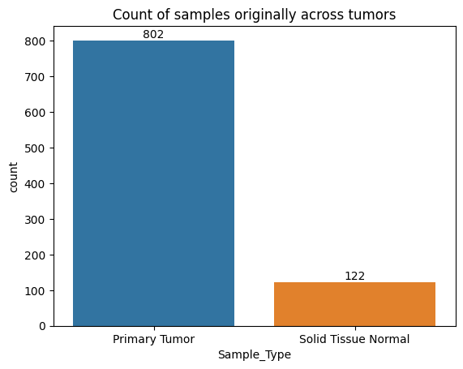
    


```python
ax = sns.countplot(x='Sample_Type_orig', data=ml_df_without_overlap )
ax.bar_label(ax.containers[0])
ax.set_title("Count of samples after separating patient overlap samples")
```

    is_categorical_dtype is deprecated and will be removed in a future version. Use isinstance(dtype, CategoricalDtype) instead
    is_categorical_dtype is deprecated and will be removed in a future version. Use isinstance(dtype, CategoricalDtype) instead
    is_categorical_dtype is deprecated and will be removed in a future version. Use isinstance(dtype, CategoricalDtype) instead


    Text(0.5, 1.0, 'Count of samples after separating patient overlap samples')


    
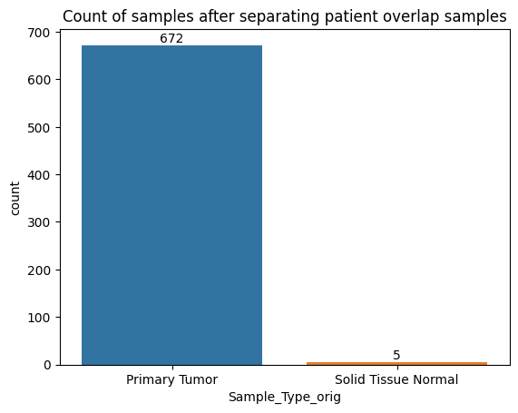
    


```python
ax = sns.countplot(x='project_id', data=ge_kidney_cancer_data_correct_labels)
ax.bar_label(ax.containers[0])
ax.set_title("Samples Count in Kidney cancer(KC) subtypes Originally")
```

    is_categorical_dtype is deprecated and will be removed in a future version. Use isinstance(dtype, CategoricalDtype) instead
    is_categorical_dtype is deprecated and will be removed in a future version. Use isinstance(dtype, CategoricalDtype) instead
    is_categorical_dtype is deprecated and will be removed in a future version. Use isinstance(dtype, CategoricalDtype) instead


    Text(0.5, 1.0, 'Samples Count in Kidney cancer(KC) subtypes Originally')


    
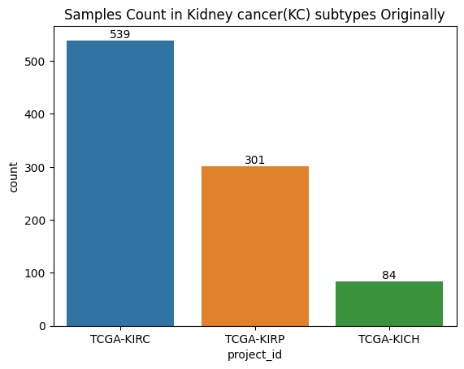
    


```python
ax = sns.countplot(x='project_id_orig', data=ml_df_without_overlap)
ax.bar_label(ax.containers[0])
ax.set_title("Samples count in KC subtypes after separating patient overlap")
```

    is_categorical_dtype is deprecated and will be removed in a future version. Use isinstance(dtype, CategoricalDtype) instead
    is_categorical_dtype is deprecated and will be removed in a future version. Use isinstance(dtype, CategoricalDtype) instead
    is_categorical_dtype is deprecated and will be removed in a future version. Use isinstance(dtype, CategoricalDtype) instead


    Text(0.5, 1.0, 'Samples count in KC subtypes after separating patient overlap')


    
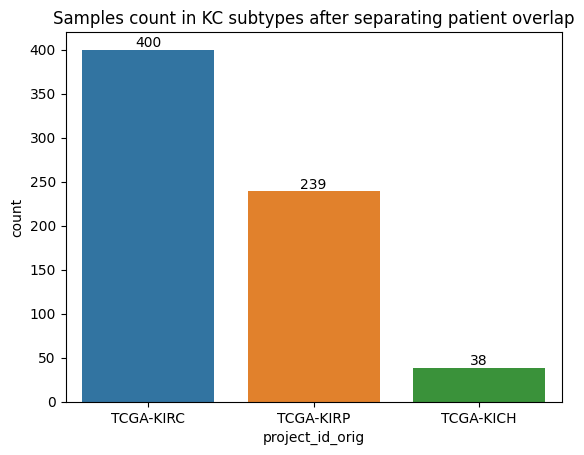
    


```python
all_minority_samples1 = ml_df_without_overlap[(ml_df_without_overlap['Sample_Type_orig'] == 'Solid Tissue Normal')
| (ml_df_without_overlap['project_id_orig'] == 'TCGA-KICH')]['Case_ID'].to_numpy()

# First split: Separate out a test set with 50% 
train_val_set_sampl_ids1, test_set_samp_ids1 = train_test_split(all_minority_samples1, test_size=0.5, random_state=42)

# Second split: Separate the remaining data into training and validation sets
train_set_samp_ids1, val_set_samp_ids1 = train_test_split(train_val_set_sampl_ids1, test_size=0.5, random_state=42) 

print(f"Number of Minority set sampled Training IDs: {len(train_set_samp_ids1)}")
print(f"Number of Minority set sampled  Validation IDs: {len(val_set_samp_ids1)}")
print(f"Number of Minority set sampled  Testing IDs: {len(test_set_samp_ids1)}")
```

    Number of Minority set sampled Training IDs: 10
    Number of Minority set sampled  Validation IDs: 11
    Number of Minority set sampled  Testing IDs: 21


```python
rem_majority_samples = ml_df_without_overlap[~ml_df_without_overlap['Case_ID'].isin(all_minority_samples1)]['Case_ID'].to_numpy()

# First split: Separate out a test set
train_val_major_ids1, test_major_ids1 = train_test_split(rem_majority_samples, test_size=0.1, random_state=42)

# Second split: Separate the remaining data into training and validation sets
train_major_ids1, val_major_ids1 = train_test_split(train_val_major_ids1, test_size=0.2, random_state=42) # 0.25 x 0.8 = 0.2

print(f"Number of majority classes Training IDs: {len(train_major_ids1)}")
print(f"Number of majority classes Validation IDs: {len(val_major_ids1)}")
print(f"Number of majority classes Testing IDs: {len(test_major_ids1)}")
```

    Number of majority classes Training IDs: 456
    Number of majority classes Validation IDs: 115
    Number of majority classes Testing IDs: 64


```python
train_ids_df = pd.DataFrame({'Case_ID': list(train_overlap_ids) + list(train_major_ids1) + list(train_set_samp_ids1)}).assign(label='training')
val_ids_df = pd.DataFrame({'Case_ID': list(val_overlap_ids) + list(val_major_ids1) + list(val_set_samp_ids1)}).assign(label='validation')
test_ids_df = pd.DataFrame({'Case_ID': list(test_overlap_ids) + list(test_major_ids1) + list(test_set_samp_ids1)}).assign(label='testing') 
train_val_test_ids_df = pd.concat([train_ids_df, val_ids_df, test_ids_df], axis=0)
```


```python
train_val_test_ids_df 
```


<div>
<style scoped>
    .dataframe tbody tr th:only-of-type {
        vertical-align: middle;
    }

    .dataframe tbody tr th {
        vertical-align: top;
    }

    .dataframe thead th {
        text-align: right;
    }
</style>
<table border="1" class="dataframe">
  <thead>
    <tr style="text-align: right;">
      <th></th>
      <th>Case_ID</th>
      <th>label</th>
    </tr>
  </thead>
  <tbody>
    <tr>
      <th>0</th>
      <td>TCGA-CW-5585</td>
      <td>training</td>
    </tr>
    <tr>
      <th>1</th>
      <td>TCGA-B0-5706</td>
      <td>training</td>
    </tr>
    <tr>
      <th>2</th>
      <td>TCGA-DZ-6132</td>
      <td>training</td>
    </tr>
    <tr>
      <th>3</th>
      <td>TCGA-CW-6090</td>
      <td>training</td>
    </tr>
    <tr>
      <th>4</th>
      <td>TCGA-BQ-7055</td>
      <td>training</td>
    </tr>
    <tr>
      <th>...</th>
      <td>...</td>
      <td>...</td>
    </tr>
    <tr>
      <th>93</th>
      <td>TCGA-KN-8418</td>
      <td>testing</td>
    </tr>
    <tr>
      <th>94</th>
      <td>TCGA-KO-8406</td>
      <td>testing</td>
    </tr>
    <tr>
      <th>95</th>
      <td>TCGA-KO-8414</td>
      <td>testing</td>
    </tr>
    <tr>
      <th>96</th>
      <td>TCGA-KL-8325</td>
      <td>testing</td>
    </tr>
    <tr>
      <th>97</th>
      <td>TCGA-KM-8438</td>
      <td>testing</td>
    </tr>
  </tbody>
</table>
<p>799 rows × 2 columns</p>
</div>


```python
train_val_test_ids_df = pd.merge(train_val_test_ids_df, ml_df[['Case_ID', 'project_id_orig', 'Sample_Type_orig']],
left_on='Case_ID',
right_on='Case_ID')
train_val_test_ids_df = train_val_test_ids_df
```


```python
train_val_test_ids_df[['label', 'Sample_Type_orig']].value_counts()
```


    label       Sample_Type_orig        
    training    Primary Tumor               556
    validation  Primary Tumor               148
    testing     Primary Tumor                96
    training    Solid Tissue Normal          86
    validation  Solid Tissue Normal          21
    testing     Solid Tissue Normal          15
    training    Additional - New Primary      1
    validation  Additional - New Primary      1
    Name: count, dtype: int64


```python
ax = sns.countplot(x='label', data=train_val_test_ids_df, hue = "project_id_orig")
ax.bar_label(ax.containers[0])
ax.set_title("Samples count in KC subtypes after separating patient overlap")
```

    is_categorical_dtype is deprecated and will be removed in a future version. Use isinstance(dtype, CategoricalDtype) instead
    is_categorical_dtype is deprecated and will be removed in a future version. Use isinstance(dtype, CategoricalDtype) instead
    is_categorical_dtype is deprecated and will be removed in a future version. Use isinstance(dtype, CategoricalDtype) instead
    is_categorical_dtype is deprecated and will be removed in a future version. Use isinstance(dtype, CategoricalDtype) instead


    Text(0.5, 1.0, 'Samples count in KC subtypes after separating patient overlap')


    
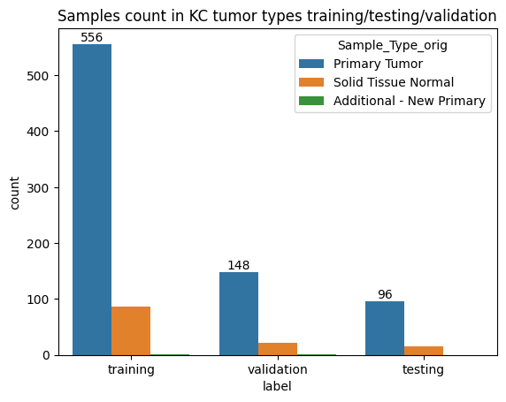
    


```python
ax = sns.countplot(x='label', data=train_val_test_ids_df, hue = "Sample_Type_orig")
ax.bar_label(ax.containers[0])
ax.set_title("Samples count in KC tumor types training/testing/validation")
```

    is_categorical_dtype is deprecated and will be removed in a future version. Use isinstance(dtype, CategoricalDtype) instead
    is_categorical_dtype is deprecated and will be removed in a future version. Use isinstance(dtype, CategoricalDtype) instead
    is_categorical_dtype is deprecated and will be removed in a future version. Use isinstance(dtype, CategoricalDtype) instead
    is_categorical_dtype is deprecated and will be removed in a future version. Use isinstance(dtype, CategoricalDtype) instead


    Text(0.5, 1.0, 'Samples count in KC tumor types training/testing/validation')


    

    


```python
train_val_test_ids_df
```


<div>
<style scoped>
    .dataframe tbody tr th:only-of-type {
        vertical-align: middle;
    }

    .dataframe tbody tr th {
        vertical-align: top;
    }

    .dataframe thead th {
        text-align: right;
    }
</style>
<table border="1" class="dataframe">
  <thead>
    <tr style="text-align: right;">
      <th></th>
      <th>Case_ID</th>
      <th>label</th>
      <th>project_id_orig</th>
      <th>Sample_Type_orig</th>
    </tr>
  </thead>
  <tbody>
    <tr>
      <th>0</th>
      <td>TCGA-CW-5585</td>
      <td>training</td>
      <td>TCGA-KIRC</td>
      <td>Primary Tumor</td>
    </tr>
    <tr>
      <th>1</th>
      <td>TCGA-CW-5585</td>
      <td>training</td>
      <td>TCGA-KIRC</td>
      <td>Solid Tissue Normal</td>
    </tr>
    <tr>
      <th>2</th>
      <td>TCGA-B0-5706</td>
      <td>training</td>
      <td>TCGA-KIRC</td>
      <td>Solid Tissue Normal</td>
    </tr>
    <tr>
      <th>3</th>
      <td>TCGA-B0-5706</td>
      <td>training</td>
      <td>TCGA-KIRC</td>
      <td>Primary Tumor</td>
    </tr>
    <tr>
      <th>4</th>
      <td>TCGA-DZ-6132</td>
      <td>training</td>
      <td>TCGA-KIRP</td>
      <td>Solid Tissue Normal</td>
    </tr>
    <tr>
      <th>...</th>
      <td>...</td>
      <td>...</td>
      <td>...</td>
      <td>...</td>
    </tr>
    <tr>
      <th>919</th>
      <td>TCGA-KN-8418</td>
      <td>testing</td>
      <td>TCGA-KICH</td>
      <td>Primary Tumor</td>
    </tr>
    <tr>
      <th>920</th>
      <td>TCGA-KO-8406</td>
      <td>testing</td>
      <td>TCGA-KICH</td>
      <td>Primary Tumor</td>
    </tr>
    <tr>
      <th>921</th>
      <td>TCGA-KO-8414</td>
      <td>testing</td>
      <td>TCGA-KICH</td>
      <td>Primary Tumor</td>
    </tr>
    <tr>
      <th>922</th>
      <td>TCGA-KL-8325</td>
      <td>testing</td>
      <td>TCGA-KICH</td>
      <td>Primary Tumor</td>
    </tr>
    <tr>
      <th>923</th>
      <td>TCGA-KM-8438</td>
      <td>testing</td>
      <td>TCGA-KICH</td>
      <td>Primary Tumor</td>
    </tr>
  </tbody>
</table>
<p>924 rows × 4 columns</p>
</div>


```python
print(f"Final train-validation-test split dataframe has {train_val_test_ids_df.shape[0]} unique samples")
```

    Final train-validation-test split dataframe has 924 unique samples


## IV. Apply multi-label classification on all features 

Objectives: 

- Here we will train different classification models on the data with no embeddings

- Address class imbalance (2 options):
  - Modify loss functions of different classifiers for imbalanced training and testing data 
  - Re-sampling of minority class in each of training and validation sets 
  

- Evaluate performance of different classifiers in training and validation cycle 

- Rank features using shapley values


```python
y_label_cols = ['cancer_subtype_TCGA-KICH', 'cancer_subtype_TCGA-KIRC',
       'cancer_subtype_TCGA-KIRP', 
       'tumor_subtype_Primary Tumor', 'tumor_subtype_Solid Tissue Normal']
X_train = ml_df[ml_df['Case_ID'].isin(train_val_test_ids_df[train_val_test_ids_df['label'] == 'training']['Case_ID'].to_numpy())][gene_cols].to_numpy()
y_train = ml_df[ml_df['Case_ID'].isin(train_val_test_ids_df[train_val_test_ids_df['label'] == 'training']['Case_ID'].to_numpy())][y_label_cols].astype(int).to_numpy()
y_train_ch = ml_df[ml_df['Case_ID'].isin(train_val_test_ids_df[train_val_test_ids_df['label'] == 'training']['Case_ID'].to_numpy())][y_label_cols]
```


```python
y_train_ch 
```


<div>
<style scoped>
    .dataframe tbody tr th:only-of-type {
        vertical-align: middle;
    }

    .dataframe tbody tr th {
        vertical-align: top;
    }

    .dataframe thead th {
        text-align: right;
    }
</style>
<table border="1" class="dataframe">
  <thead>
    <tr style="text-align: right;">
      <th></th>
      <th>cancer_subtype_TCGA-KICH</th>
      <th>cancer_subtype_TCGA-KIRC</th>
      <th>cancer_subtype_TCGA-KIRP</th>
      <th>tumor_subtype_Primary Tumor</th>
      <th>tumor_subtype_Solid Tissue Normal</th>
    </tr>
  </thead>
  <tbody>
    <tr>
      <th>2</th>
      <td>False</td>
      <td>True</td>
      <td>False</td>
      <td>True</td>
      <td>False</td>
    </tr>
    <tr>
      <th>3</th>
      <td>False</td>
      <td>False</td>
      <td>True</td>
      <td>True</td>
      <td>False</td>
    </tr>
    <tr>
      <th>4</th>
      <td>False</td>
      <td>False</td>
      <td>True</td>
      <td>False</td>
      <td>True</td>
    </tr>
    <tr>
      <th>5</th>
      <td>False</td>
      <td>False</td>
      <td>True</td>
      <td>True</td>
      <td>False</td>
    </tr>
    <tr>
      <th>6</th>
      <td>True</td>
      <td>False</td>
      <td>False</td>
      <td>True</td>
      <td>False</td>
    </tr>
    <tr>
      <th>...</th>
      <td>...</td>
      <td>...</td>
      <td>...</td>
      <td>...</td>
      <td>...</td>
    </tr>
    <tr>
      <th>1284</th>
      <td>False</td>
      <td>True</td>
      <td>False</td>
      <td>True</td>
      <td>False</td>
    </tr>
    <tr>
      <th>1286</th>
      <td>False</td>
      <td>True</td>
      <td>False</td>
      <td>True</td>
      <td>False</td>
    </tr>
    <tr>
      <th>1290</th>
      <td>False</td>
      <td>False</td>
      <td>True</td>
      <td>True</td>
      <td>False</td>
    </tr>
    <tr>
      <th>1292</th>
      <td>False</td>
      <td>True</td>
      <td>False</td>
      <td>True</td>
      <td>False</td>
    </tr>
    <tr>
      <th>1293</th>
      <td>False</td>
      <td>True</td>
      <td>False</td>
      <td>True</td>
      <td>False</td>
    </tr>
  </tbody>
</table>
<p>643 rows × 5 columns</p>
</div>


```python
y_label_cols = ['cancer_subtype_TCGA-KICH', 'cancer_subtype_TCGA-KIRC',
       'cancer_subtype_TCGA-KIRP', 
       'tumor_subtype_Primary Tumor', 'tumor_subtype_Solid Tissue Normal']
X_val = ml_df[ml_df['Case_ID'].isin(train_val_test_ids_df[train_val_test_ids_df['label'] == 'validation']['Case_ID'].to_numpy())][gene_cols].to_numpy()
y_val = ml_df[ml_df['Case_ID'].isin(train_val_test_ids_df[train_val_test_ids_df['label'] == 'validation']['Case_ID'].to_numpy())][y_label_cols].astype(int).to_numpy()
y_val_ch = ml_df[ml_df['Case_ID'].isin(train_val_test_ids_df[train_val_test_ids_df['label'] == 'validation']['Case_ID'].to_numpy())][y_label_cols]
# X_val_umap = plane_mapper.fit_transform(X_val) 
```


```python
y_label_cols = ['cancer_subtype_TCGA-KICH', 'cancer_subtype_TCGA-KIRC',
       'cancer_subtype_TCGA-KIRP',
       'tumor_subtype_Primary Tumor', 'tumor_subtype_Solid Tissue Normal']
X_test = ml_df[ml_df['Case_ID'].isin(train_val_test_ids_df[train_val_test_ids_df['label'] == 'testing']['Case_ID'].to_numpy())][gene_cols].to_numpy()
y_test = ml_df[ml_df['Case_ID'].isin(train_val_test_ids_df[train_val_test_ids_df['label'] == 'testing']['Case_ID'].to_numpy())][y_label_cols].astype(int).to_numpy()
y_test_ch = ml_df[ml_df['Case_ID'].isin(train_val_test_ids_df[train_val_test_ids_df['label'] == 'testing']['Case_ID'].to_numpy())][y_label_cols]
```

## 4.2. Applying Ensemble of classifier Models to train and evaluate performance


```python
from sklearn.pipeline import make_pipeline
from sklearn.linear_model import LogisticRegression
from sklearn.preprocessing import OneHotEncoder
from sklearn.multioutput import MultiOutputClassifier
from sklearn.linear_model import LogisticRegression
from sklearn.svm import SVC
from sklearn.tree import DecisionTreeClassifier
from sklearn.linear_model import LogisticRegression
from sklearn.tree import DecisionTreeClassifier
from sklearn.ensemble import RandomForestClassifier
from sklearn.neighbors import KNeighborsClassifier
from sklearn.naive_bayes import GaussianNB
from sklearn.svm import SVC
from sklearn.multioutput import MultiOutputClassifier
from sklearn.linear_model import LogisticRegression
import matplotlib.pyplot as plt
from sklearn.metrics import RocCurveDisplay
from sklearn.metrics import roc_auc_score
from sklearn.datasets import make_circles, make_classification, make_moons

from sklearn.model_selection import train_test_split
from sklearn.pipeline import make_pipeline
from sklearn.preprocessing import StandardScaler
from sklearn.svm import SVC
from sklearn.ensemble import AdaBoostClassifier, RandomForestClassifier
from sklearn.tree import DecisionTreeClassifier
from sklearn.metrics import auc, roc_curve
from itertools import cycle
from sklearn.metrics import multilabel_confusion_matrix
import matplotlib.pyplot as plt
import numpy as np

from sklearn.datasets import fetch_openml
from sklearn.linear_model import LogisticRegression
from sklearn.metrics import jaccard_score
from sklearn.model_selection import train_test_split
from sklearn.multiclass import OneVsRestClassifier
from sklearn.multioutput import ClassifierChain
```

## 4.1. Define all ensemble based models for multi output


```python
import src.base_ml_models as ens_models
reload(ens_models)
dict_of_base_models = {

# "clf_rfc": RandomForestClassifier(
#         max_depth=5, n_estimators=10, max_features=1, random_state=42
#     ),
# "clf_dtc": DecisionTreeClassifier(random_state=42),
"clf_lr": LogisticRegression(solver='liblinear', penalty='l1', random_state=42),
# "clf_svc": SVC(kernel="rbf", C=0.025, random_state=42),
# "clf_gnb": GaussianNB(),
# "clf_knn": KNeighborsClassifier(),
"clf_ada": AdaBoostClassifier()
}
clf_obj = ens_models.BaseEnsembleClf(dict_of_base_models, num_labels=5, random_state=42, prob_thresh=0.5)
model_train_val_outs = clf_obj.train_clf(X_train=X_train, y_train=y_train, X_val=X_val, y_val=y_val)
```


```python
model_train_val_outs
```


    {'clf_rfc': {'model_scores': [0.7107843137254901,
       0.7299019607843138,
       0.7313725490196078,
       0.7333333333333334,
       0.7269607843137254,
       0.7210784313725489,
       0.7284313725490197],
      'model_names': ('Independent',
       'Chain 1',
       'Chain 2',
       'Chain 3',
       'Chain 4',
       'Chain 5',
       'Ensemble'),
      'chain_jaccard_scores': [0.7299019607843138,
       0.7313725490196078,
       0.7333333333333334,
       0.7269607843137254,
       0.7210784313725489],
      'chains': [ClassifierChain(base_estimator=RandomForestClassifier(max_depth=5,
                                                             max_features=1,
                                                             n_estimators=10,
                                                             random_state=42),
                       order='random', random_state=0),
       ClassifierChain(base_estimator=RandomForestClassifier(max_depth=5,
                                                             max_features=1,
                                                             n_estimators=10,
                                                             random_state=42),
                       order='random', random_state=1),
       ClassifierChain(base_estimator=RandomForestClassifier(max_depth=5,
                                                             max_features=1,
                                                             n_estimators=10,
                                                             random_state=42),
                       order='random', random_state=2),
       ClassifierChain(base_estimator=RandomForestClassifier(max_depth=5,
                                                             max_features=1,
                                                             n_estimators=10,
                                                             random_state=42),
                       order='random', random_state=3),
       ClassifierChain(base_estimator=RandomForestClassifier(max_depth=5,
                                                             max_features=1,
                                                             n_estimators=10,
                                                             random_state=42),
                       order='random', random_state=4)]},
     'clf_dtc': {'model_scores': [0.8656862745098038,
       0.8725490196078431,
       0.8794117647058823,
       0.8828431372549018,
       0.8637254901960784,
       0.8745098039215685,
       0.8892156862745098],
      'model_names': ('Independent',
       'Chain 1',
       'Chain 2',
       'Chain 3',
       'Chain 4',
       'Chain 5',
       'Ensemble'),
      'chain_jaccard_scores': [0.8725490196078431,
       0.8794117647058823,
       0.8828431372549018,
       0.8637254901960784,
       0.8745098039215685],
      'chains': [ClassifierChain(base_estimator=DecisionTreeClassifier(random_state=42),
                       order='random', random_state=0),
       ClassifierChain(base_estimator=DecisionTreeClassifier(random_state=42),
                       order='random', random_state=1),
       ClassifierChain(base_estimator=DecisionTreeClassifier(random_state=42),
                       order='random', random_state=2),
       ClassifierChain(base_estimator=DecisionTreeClassifier(random_state=42),
                       order='random', random_state=3),
       ClassifierChain(base_estimator=DecisionTreeClassifier(random_state=42),
                       order='random', random_state=4)]},
     'clf_lr': {'model_scores': [0.9568627450980391,
       0.9509803921568627,
       0.9588235294117647,
       0.9627450980392158,
       0.961764705882353,
       0.9588235294117647,
       0.9539215686274511],
      'model_names': ('Independent',
       'Chain 1',
       'Chain 2',
       'Chain 3',
       'Chain 4',
       'Chain 5',
       'Ensemble'),
      'chain_jaccard_scores': [0.9509803921568627,
       0.9588235294117647,
       0.9627450980392158,
       0.961764705882353,
       0.9588235294117647],
      'chains': [ClassifierChain(base_estimator=LogisticRegression(penalty='l1', random_state=42,
                                                         solver='liblinear'),
                       order='random', random_state=0),
       ClassifierChain(base_estimator=LogisticRegression(penalty='l1', random_state=42,
                                                         solver='liblinear'),
                       order='random', random_state=1),
       ClassifierChain(base_estimator=LogisticRegression(penalty='l1', random_state=42,
                                                         solver='liblinear'),
                       order='random', random_state=2),
       ClassifierChain(base_estimator=LogisticRegression(penalty='l1', random_state=42,
                                                         solver='liblinear'),
                       order='random', random_state=3),
       ClassifierChain(base_estimator=LogisticRegression(penalty='l1', random_state=42,
                                                         solver='liblinear'),
                       order='random', random_state=4)]},
     'clf_svc': {'model_scores': [0.6480392156862744,
       0.6480392156862744,
       0.6480392156862744,
       0.6480392156862744,
       0.6480392156862744,
       0.6480392156862744,
       0.6480392156862744],
      'model_names': ('Independent',
       'Chain 1',
       'Chain 2',
       'Chain 3',
       'Chain 4',
       'Chain 5',
       'Ensemble'),
      'chain_jaccard_scores': [0.6480392156862744,
       0.6480392156862744,
       0.6480392156862744,
       0.6480392156862744,
       0.6480392156862744],
      'chains': [ClassifierChain(base_estimator=SVC(C=0.025, random_state=42), order='random',
                       random_state=0),
       ClassifierChain(base_estimator=SVC(C=0.025, random_state=42), order='random',
                       random_state=1),
       ClassifierChain(base_estimator=SVC(C=0.025, random_state=42), order='random',
                       random_state=2),
       ClassifierChain(base_estimator=SVC(C=0.025, random_state=42), order='random',
                       random_state=3),
       ClassifierChain(base_estimator=SVC(C=0.025, random_state=42), order='random',
                       random_state=4)]},
     'clf_gnb': {'model_scores': [0.6715686274509803,
       0.6715686274509803,
       0.6715686274509803,
       0.6715686274509803,
       0.6715686274509803,
       0.6715686274509803,
       0.6715686274509803],
      'model_names': ('Independent',
       'Chain 1',
       'Chain 2',
       'Chain 3',
       'Chain 4',
       'Chain 5',
       'Ensemble'),
      'chain_jaccard_scores': [0.6715686274509803,
       0.6715686274509803,
       0.6715686274509803,
       0.6715686274509803,
       0.6715686274509803],
      'chains': [ClassifierChain(base_estimator=GaussianNB(), order='random', random_state=0),
       ClassifierChain(base_estimator=GaussianNB(), order='random', random_state=1),
       ClassifierChain(base_estimator=GaussianNB(), order='random', random_state=2),
       ClassifierChain(base_estimator=GaussianNB(), order='random', random_state=3),
       ClassifierChain(base_estimator=GaussianNB(), order='random', random_state=4)]},
     'clf_knn': {'model_scores': [0.9166666666666665,
       0.9166666666666665,
       0.9166666666666665,
       0.9166666666666665,
       0.9166666666666665,
       0.9166666666666665,
       0.9166666666666665],
      'model_names': ('Independent',
       'Chain 1',
       'Chain 2',
       'Chain 3',
       'Chain 4',
       'Chain 5',
       'Ensemble'),
      'chain_jaccard_scores': [0.9166666666666665,
       0.9166666666666665,
       0.9166666666666665,
       0.9166666666666665,
       0.9166666666666665],
      'chains': [ClassifierChain(base_estimator=KNeighborsClassifier(), order='random',
                       random_state=0),
       ClassifierChain(base_estimator=KNeighborsClassifier(), order='random',
                       random_state=1),
       ClassifierChain(base_estimator=KNeighborsClassifier(), order='random',
                       random_state=2),
       ClassifierChain(base_estimator=KNeighborsClassifier(), order='random',
                       random_state=3),
       ClassifierChain(base_estimator=KNeighborsClassifier(), order='random',
                       random_state=4)]},
     'clf_ada': {'model_scores': [0.9509803921568627,
       0.9460784313725489,
       0.95,
       0.95,
       0.9637254901960783,
       0.9637254901960783,
       0.95],
      'model_names': ('Independent',
       'Chain 1',
       'Chain 2',
       'Chain 3',
       'Chain 4',
       'Chain 5',
       'Ensemble'),
      'chain_jaccard_scores': [0.9460784313725489,
       0.95,
       0.95,
       0.9637254901960783,
       0.9637254901960783],
      'chains': [ClassifierChain(base_estimator=AdaBoostClassifier(), order='random',
                       random_state=0),
       ClassifierChain(base_estimator=AdaBoostClassifier(), order='random',
                       random_state=1),
       ClassifierChain(base_estimator=AdaBoostClassifier(), order='random',
                       random_state=2),
       ClassifierChain(base_estimator=AdaBoostClassifier(), order='random',
                       random_state=3),
       ClassifierChain(base_estimator=AdaBoostClassifier(), order='random',
                       random_state=4)]}}


## 4.2 Plot validation set performances of different models


```python
def plot_performance(model_scores, model_names, chain_jaccard_scores, text, ax):
    """
    Plot the performance of the ensemble vs. independent classifier chains
    :param model_scores: list of scores for each model
    :param model_names: list of names for each model
    :param chain_jaccard_scores: list of scores for each chain
    :param text: Title text for the plot
    :param ax: Axes object to plot on
    """
    x_pos = np.arange(len(model_names))
    ax.grid(True)
    ax.set_title(f"{text} Chain Classifier Ensemble Performance Comparison")
    ax.set_xticks(x_pos)
    ax.set_xticklabels(model_names, rotation="vertical")
    ax.set_ylabel("Jaccard Similarity Score")
    ax.set_ylim([min(model_scores) * 0.9, max(model_scores) * 1.1])
    colors = ["r"] + ["b"] * len(chain_jaccard_scores) + ["g"]
    ax.bar(x_pos, model_scores, alpha=0.5, color=colors)

# Create a list of classifier names
clf_names = list(dict_of_base_models.keys())

# Create a grid of subplots
num_plots = len(clf_names)
num_cols = 3  # Number of columns in the grid
num_rows = (num_plots - 1) // num_cols + 1

fig, axs = plt.subplots(num_rows, num_cols, figsize=(15, 4 * num_rows))
fig.tight_layout(pad=3.0)

# Iterate through the classifiers and plot in subplots
for i, clf_name in enumerate(clf_names):
    row = i // num_cols
    col = i % num_cols
    model_scores, model_names, chain_jaccard_scores = model_train_val_outs[clf_name]['model_scores'], model_train_val_outs[clf_name]['model_names'], model_train_val_outs[clf_name]['chain_jaccard_scores']
    plot_performance(model_scores, model_names, chain_jaccard_scores, text=clf_name, ax=axs[row, col])

# Hide any empty subplots
for i in range(num_plots, num_rows * num_cols):
    row = i // num_cols
    col = i % num_cols
    axs[row, col].axis('off')
    plt.tight_layout()
plt.show()
```


    

    


## 4.3. ROC's


```python
from sklearn.metrics import roc_curve, auc, confusion_matrix, accuracy_score
```


```python
from sklearn.metrics import roc_curve, auc
import matplotlib.pyplot as plt

def calculate_roc_curve_ensemble(model_outs, X_val, y_val, prob_thresh=0.5):
    """
    Calculate ROC curve and AUC for the ensemble model of each classifier.
    
    :param model_outs: Dictionary containing model outputs as returned by train_clf.
    :param X_val: Validation data.
    :param y_val: Validation labels.
    :param prob_thresh: Probability threshold for binary classification (default is 0.5).
    :return: Dictionary containing ROC curves and AUC values for each classifier.
    """
    roc_auc_dict = {}
    fpr_dict = {}
    tpr_dict = {}

    for clf_name, model_data in model_outs.items():
        chains = model_data['chains']
        n_classes = y_val.shape[1]
        y_score = np.zeros((len(chains), len(X_val), n_classes))

        for i, chain in enumerate(chains):
            y_score[i] = chain.predict(X_val)

        y_score_ensemble = y_score.mean(axis=0) >= prob_thresh
        fpr = {}
        tpr = {}
        roc_auc = {}

        for i in range(n_classes):
            fpr[i], tpr[i], _ = roc_curve(y_val[:, i], y_score_ensemble[:, i])
            roc_auc[i] = auc(fpr[i], tpr[i])

        fpr['micro'], tpr['micro'], _ = roc_curve(y_val.ravel(), y_score_ensemble.ravel())
        roc_auc['micro'] = auc(fpr['micro'], tpr['micro'])

        roc_auc_dict[clf_name] = roc_auc
        fpr_dict[clf_name] = fpr
        tpr_dict[clf_name] = tpr

    return roc_auc_dict, fpr_dict, tpr_dict

# Calculate ROC curves for your ensemble classifiers
roc_auc_dict, fpr_dict, tpr_dict = calculate_roc_curve_ensemble(model_train_val_outs, X_val, y_val, prob_thresh=0.5)

# Plot ROC curves for each classifier
for clf_name, roc_auc in roc_auc_dict.items():
    plt.figure()
    lw = 2
    plt.plot(fpr_dict[clf_name]['micro'], tpr_dict[clf_name]['micro'], color='darkorange',
             lw=lw, label=f'Micro-average ROC curve (area = {roc_auc["micro"]:.2f})')
    for i in range(y_val.shape[1]):
        plt.plot(fpr_dict[clf_name][i], tpr_dict[clf_name][i], lw=lw,
                 label=f'ROC curve (area = {roc_auc[i]:.2f}) for label {i}')
    plt.plot([0, 1], [0, 1], color='navy', lw=lw, linestyle='--')
    plt.xlim([0.0, 1.0])
    plt.ylim([0.0, 1.05])
    plt.xlabel('False Positive Rate')
    plt.ylabel('True Positive Rate')
    plt.title(f'ROC Curve for {clf_name}')
    plt.legend(loc="lower right")
    plt.show()
```


    
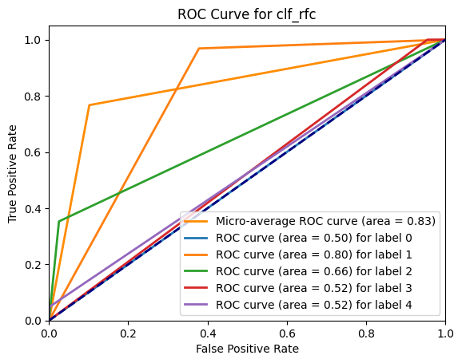
    


    
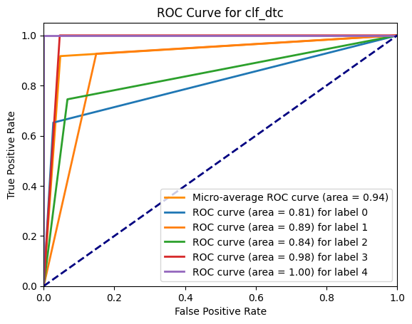
    


    

    


    
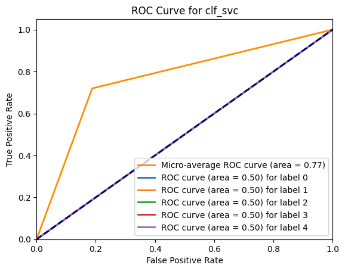
    


    
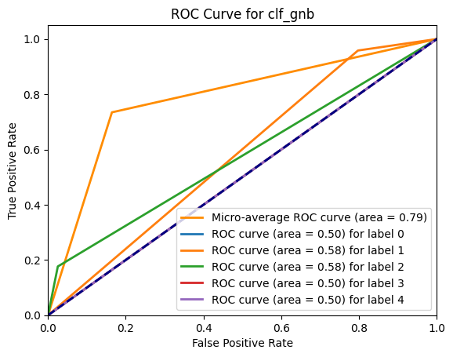
    


    
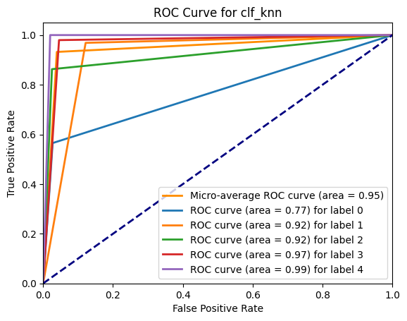
    


    
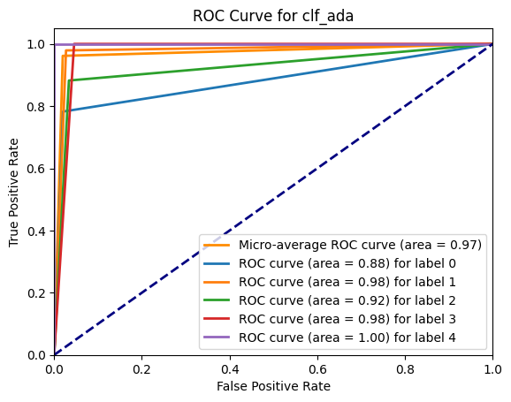
    


## 4.4. Generate swarmplots for different label categories


```python

```
