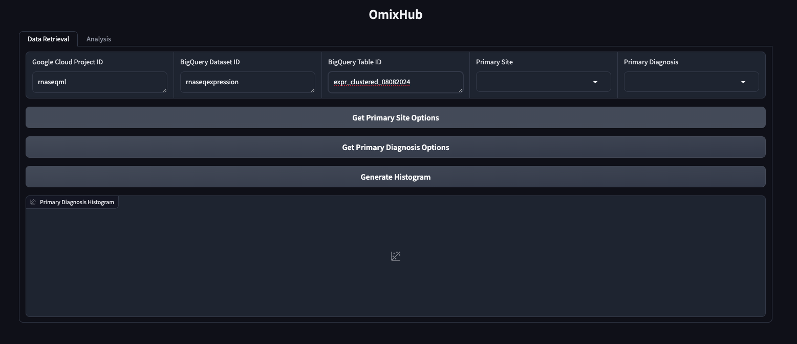
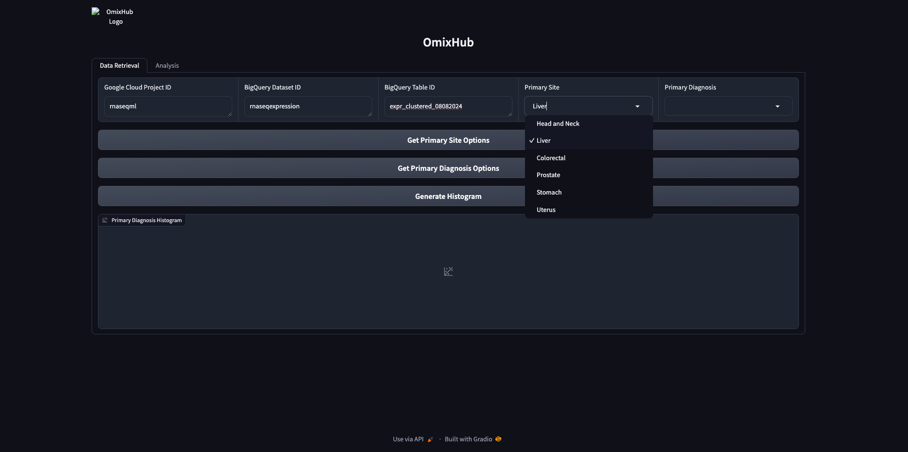
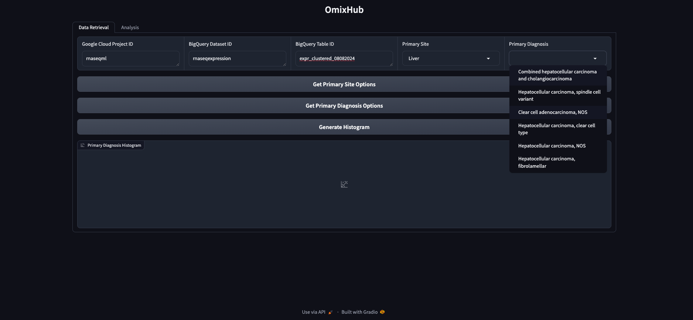

## OmixHub Gradio App

#### Landing Page (Cohort Selection)

- Input the Google Cloud Project ID, Dataset ID and table ID 
- Click on `Get Primary Site Options` to see a list of dropdown options for primary site 

- Upon selection of primary site, click on `Get Primary Diagnosis Options` to get a list of Tumor types available for this primary_site. 

- This will select and save the dataset to be available for analysis in the analysis tab. 